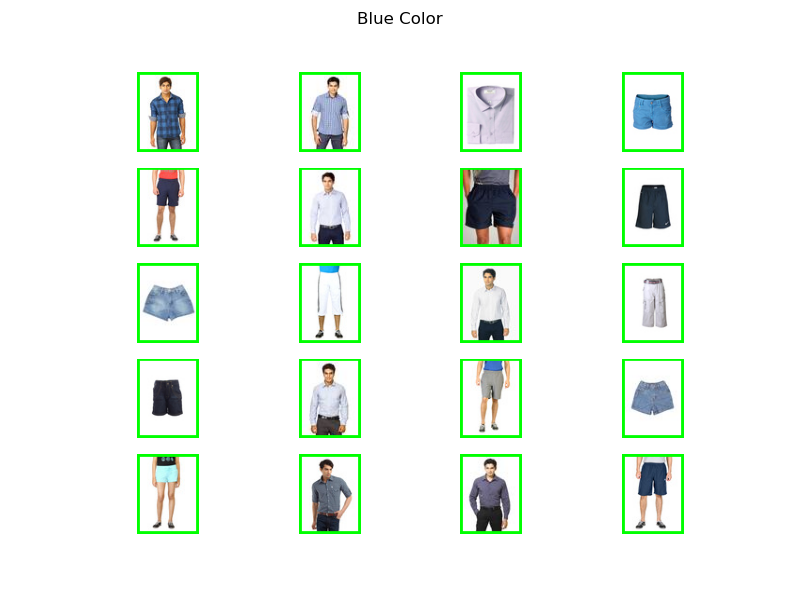

# Clothing classifier

Automatic classification of clothing items from a set of images.
To classify clothes we use two algorithms:

**1. k-Nearest Neighbors (k-NN):** It assigns a label to each item based on the labels of its nearest neighbors in the feature space. For clothing, k-NN helps determine the type of garment by comparing it to similar examples in the dataset.

**2. k-means Clustering:** This method groups data points based on their similarity in feature space. In our case, it helps identify the predominant color of each clothing item. By analyzing pixel values in the images, k-means finds clusters corresponding to different colors, allowing us to determine the most common color for each garment.

## Project structure:
* **images:** Contains the images that we will use. In this directory there are:
  * **test:** It's a directory with images for test
  * **train:** It's a directory with images for train
  * **gt_reduced.json:** Contains the information with the classes for each images
  * **gt.json:** Same that `gt_reduced.json` but with more data.
  * **remove.py:** Remove all the images that aren't used

* **src:** Directory with all the code for the execution
  * **Kmeans.py:** Contains the code related to kmeans algorithm, it can be configured at the begining.
  * **KNN.py:** Contains the code related to knn algorithm.
  * **TestCase_knn.py:** Test functions for check knn implementation.
  * **TestCase_kmeans.py:** Test functions for check kmeans implementation.
  * **utils_data.py:** Contains functions a series of functions for the visualization of results
  * **utils.py:** Contains functions  needed to convert color images to other spaces, mainly converting them to grayscale.
  * **visualization.py:** Contains functions to test images and visualize the result

* **test:** Contains the files required to configure the test environment.

### Cloth classes:
There are 8 shapes classes. The shapes are: 
**[Dresses, Flip Flops, Jeans, Sandals, Shirts, Shorts, Socks, Handbags]**

### Color classes:
There are 11 color classes. The colors are: 
**[Red, Orange, Brown, Yellow, Green, Blue, Purple, Pink, Black, Grey, White]**

## Dataset

The images are low-resolution (60px X 90px) for a better performance and less space required.

The dataset is from Kaggle and it's avaiable here: [Kaggle](https://www.kaggle.com/datasets/paramaggarwal/fashion-product-images-small/data)

The number of images in this repository is smaller than the original version, so errors with shape or color accuracy can probably occur.

## Visualization
Output of `show_color(...)` function, in `visualization.py`. The color can be changed, and the green box indicates that the prediction should be correct.

